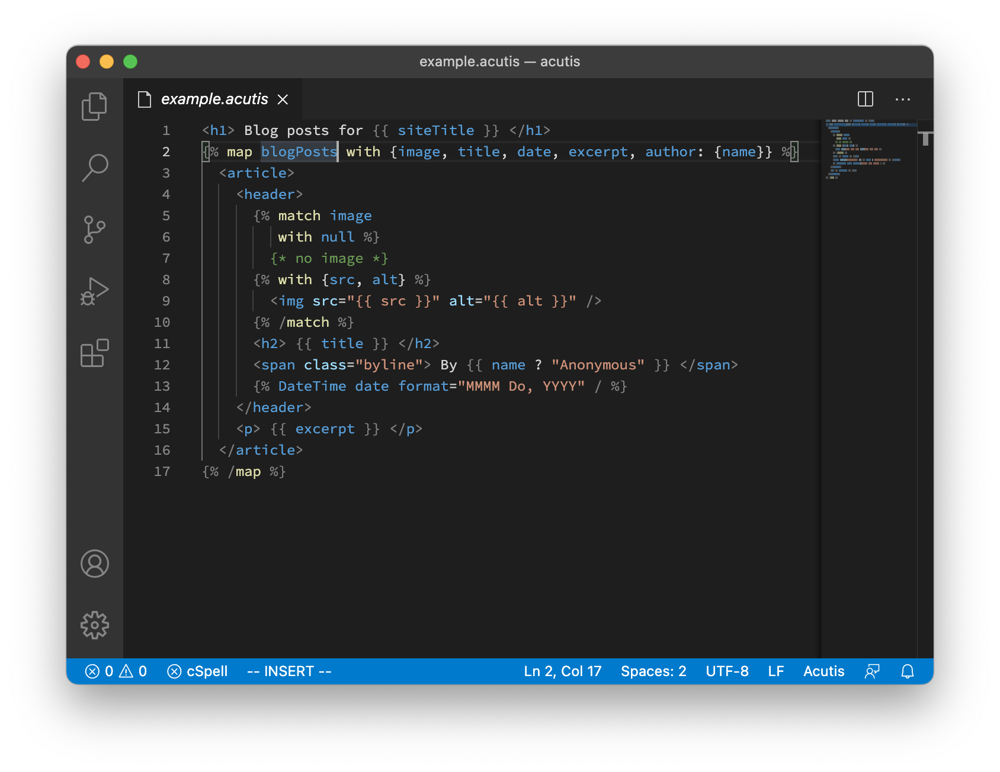

# acutis-vscode

This is the VS Code extension for the [Acutis language].

[Acutis language]: https://johnridesa.bike/acutis/

## Features

This extension provides syntax highlighting for `.acutis` files.

## Limitations

This extension is optimized for embedding Acutis in HTML, or HTML-like,
languages. It only provides syntax highlighting.

## Release Notes

### 0.1.0

Initial release of acutis-vscode.